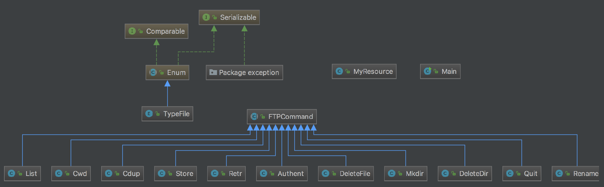
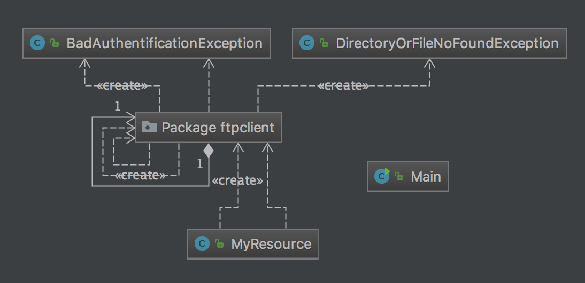

TP2 EN CAR: Client et Passerelle FTP en Java
============================================


Sophie Danneels, Thomas Campistron

Pour lancer le tp:
1. `mvn package dans le dossier Serveur`
* `mvn exec:java`

Nous avons testé notre passerelle avec ce [serveur](https://gitlab-etu.fil.univ-lille1.fr/campistron/car-tp1-campistron)
 uniquement en local et sur le port 5555, sous linux et macOS.

La javadoc est générée en faisant: `mvn javadoc:javadoc`
	

### 1/ Introduction

Ce logiciel a pour but de fournir une passerelle entre une client (navigateur / curl / postman) et un serveur ftp implémentant la norme *FTP RFC 959*.  
Les commandes qui ont été faites sont:  
* CWD - Change to the given directory
* CDUP - Change to Parent Directory
* PWD - Print current Directory
* LIST - List files and directories within the current repertory
* STOR - Store a file - not a repertory! - in the current repertory on the server
* RETR - Get a file - not a repertory! - from the current repertory on the server
* MKD - Make Directory
* DELETE - delete a file or a repertory
* RENAME - rename a file or a repertory
* PASV - switch between passiv and activ mode (se fait via le fichier de configuration)


### 2/ Architecture

#### Design pattern utilisé  

Afin de faciliter l'implémentation des classes et rendre l'architecture claire, nous avons opté pour le command pattern.
La classe __FTPCommand__ sert de Client FTP et permet d'invoquer toutes les commandes implémentée sur la passerelle en faisant le relais avec le client ftp.
Ces commandes sont matérialsée par leur classe respectivement munie de la méthode execute pour exécuter les commandes, ainsi que de quelques sous-fonctions dédiées.  

Ce pattern permet d'organiser les éléments du serveur ftp par catégorie d'objets.  
Les classes de commande/processus implémentent une classe abstraite __FTPCommand__ qui contient le prototype de la fonction execute ainsi que les fonctions de connexion et déconnexion.  

Nous avons créé des classes d'exception dédiées à certaines erreurs possibles dans le traitement des commandes.
Par exemple, lorsqu'une commande échoue a la connexion elle renvoie l'exception __BadAuthentificationException__.

#### Liste détection d'erreurs throw new

* throws IOException
* throws DirectoryOrFileNotFoundException
* throws BadAuthentificationException

#### UML

Sans montrer les dépendances :



Avec dépendances :



### 3/ Parcours du Code Code Samples

5 exemples de code ( code samples):
* une methodes contenant un algorithme
* une liste de casse impliquées dans un desing pattern
* une jolie optimisation
* 2 phrases pour décrire l'essentiel vient ensuite dans des commentaires //
* moins de 20 lignes et 3 indentations

#### 1 er Code Sample Code Dans FTPCommand

Le code qui sera utilisé dans le execute de toutes les classes qui héritent de FTPCommand permettant de se connecter.

```java
protected boolean connect() throws IOException, BadAuthentificationException {
	if (this.ftp.isConnected())
		return true;

	System.out.println("In connect...");
	try {
		ConfigServeur c = new ConfigServeur();

		this.ftp.connect(c.getServeur(), c.getPort());
		if(c.getModeActive())
			this.setActiveMode();
		else
			this.setPassiveMode();
		System.out.println("After connection to server...");

		System.out.println("Going to connect with " + this.username + " " + this.password + "...");
		if (this.ftp.login(this.username, this.password))
			return true;
		else
			throw new BadAuthentificationException("bad login or bad password");

	} catch (IOException e) {
		System.out.println("Failed, before disconnect...");
		this.ftp.disconnect(); /* can throw IOException */
		throw e;
	}
}
```

### 2eme Code Sample Dans FileConfig

Pourquoi ce Code? C'était intéréssant de voir une autre manière que de lire dans une boucle et d'eviter de devoir lire avec un File.

```java
public ConfigServeur() {
	try {

		input = new FileInputStream("config.properties");
		prop.load(input);
		this.port = Integer.parseInt(prop.getProperty("port"));
		this.serveur = prop.getProperty("serveur");
		if (prop.getProperty("mode_actif").equals("true")){
			mode_actif = true;
		}
		else{
			mode_actif = false;
		}

	} catch (IOException ex) {
		ex.printStackTrace();
	}

	finally {
		if (input != null) {
			try {
				input.close();
			} catch (IOException e) {
				e.printStackTrace();
			}
		}
	}

}
```


### 3eme Code Sample Retr : Le code qui récupère un fichier

C'est l'un des codes qui nous a causé le plus de problèmes.
Il effectue une boucle après avoir appelé une première fois `retrieveFileStream()` qui permet de récupérer un fichier en entier, sans cette boucle nous étions limité à des fichiers de 8ko maximum ou alors nous ne lisions que le début du fichier.
Ensuite elle renvoie l'input stream qui sera "ouvert" par jersey et envoyé a traver le réseau.

```java
public Response execute() throws BadAuthentificationException, IOException {
	System.out.println("retr called...");

	InputStream io = null;
	try{this.connect();
		if (TypeFile.BINARY == type){
			this.ftp.setFileTransferMode(FTP.BINARY_FILE_TYPE);
			this.ftp.setFileType(FTP.BINARY_FILE_TYPE);}

		else{
			this.ftp.setFileTransferMode(FTP.ASCII_FILE_TYPE);
			this.ftp.setFileType(FTP.BINARY_FILE_TYPE);
		}
		io = this.ftp.retrieveFileStream(this.path + "/" + this.file);
		if (io != null){
			return Response.ok(io).build();}

		while(!this.ftp.completePendingCommand()){
			io = this.ftp.retrieveFileStream(this.path + "/" + this.file);
		}
		return Response.status(Response.Status.BAD_REQUEST).build();
	}
	catch (BadAuthentificationException e) {
		throw new BadAuthentificationException("bad login or bad password");
	}
```

### 4eme Code Sample Retr : Le code qui permet de déclencher une Response quand il y a une exception 

On a pu découvrir comment après avoir déclencher une erreur recevoir une Response.

```java
@Provider
public class BadAuthentificationException extends Exception implements ExceptionMapper<BadAuthentificationException> {

	public BadAuthentificationException() {
		super("bad login or bad password");
	}


	public BadAuthentificationException(String msg) {
		super(msg);
	}


	@Override
	public Response toResponse(BadAuthentificationException exception) {
		return Response.status(Status.UNAUTHORIZED).entity(exception.getMessage()).build();
	}
```
### 5/ Problèmes

#### Faire un jar

Avec les commandes que l'ont nous a demandé d'utiliser pour générer le projet maven n'est pas capable de générer un jar fonctionnel et des fois fais des dump de 4-5mo d'erreurs.
	Pour pouvoir quand même executer notre projet nous devions executer directement les .class sans passer par le jar (exec:java)

#### Navigateur cross-origin

Par défaut les navigateurs ne peuvent pas envoyer des requetes avec des méthodes autres que **GET** ou **POST**, ils doivent faire une "pré-requete" vers le serveur pour lui demander s'il veit bien accepter ce type de requete.
	Le serveur Jersey ne répond pas a cette requete et le navigateur refuse donc d'envoyer nos requetes. Il faut donc lancer le navigateur en lui précisant de "Désactiver les réstrictions multi-origine"

------------------

Si la pluspart des commandes sont parfaitement fonctionnelle directement dans un navigateur il en reste certaine avec un comportement spécial;

#### Retr

Retr semble s'executer correctement sur les fichiers texte mais si l'on regarde précisément les octets que nous recevons on s'apperçois qu'ils ne sont pas exactement pareil.
Cela pose problème par exemple lorsque l'on essaie d'envoyer une image ou une vidéo.
	Nous avons identifié que c'étais le navigateur qui détruisais nos fichier. Pour régler le problème il faut passer par curl.

#### Store

Le formulaire était trop compliqué à mettre en place et nous manquions de temps.
	Il faut appeler cette méthode via postman ou curl.


